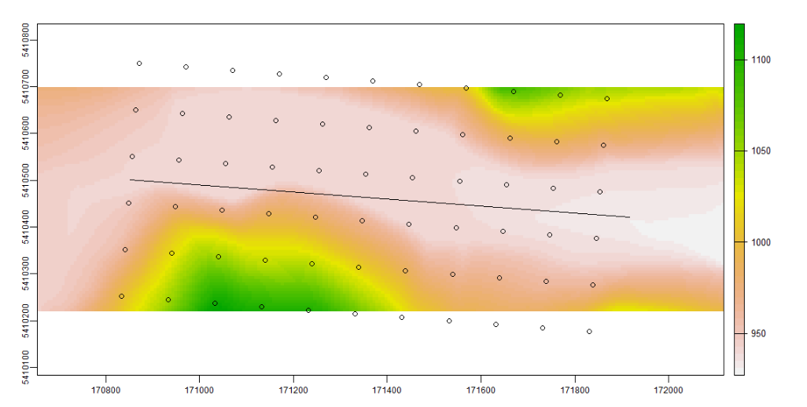

<!-- README.md is generated from README.Rmd. Please edit that file -->

# remr

<!-- badges: start -->

[](https://github.com/joshualerickson/remr/actions)
[](https://lifecycle.r-lib.org/articles/stages.html#experimental)
<!-- badges: end -->

The goal of `remr` is to get transects along a linestring so that you
can then perform a Relative Elevation Model.

## Installation

And the development version from [GitHub](https://github.com/) with:

``` r
# install.packages("devtools")
devtools::install_github("joshualerickson/remr")
```

## Example

This is a basic example which shows you how to solve a common problem:

``` r
library(remr)
line <- mapedit::drawFeatures() %>% 
  sf::st_transform(32612)

ele <- elevatr::get_elev_raster(line, z = 13)
terra::crs(ele) <- '+proj=utm +zone=12 +datum=WGS84 +units=m +no_defs'

rem <- get_transects(line, ele, distance = 100, length = 500)

terra::plot(ele_crop)
plot(line$geometry, add = TRUE)
plot(rem$geometry, add = TRUE)
```


