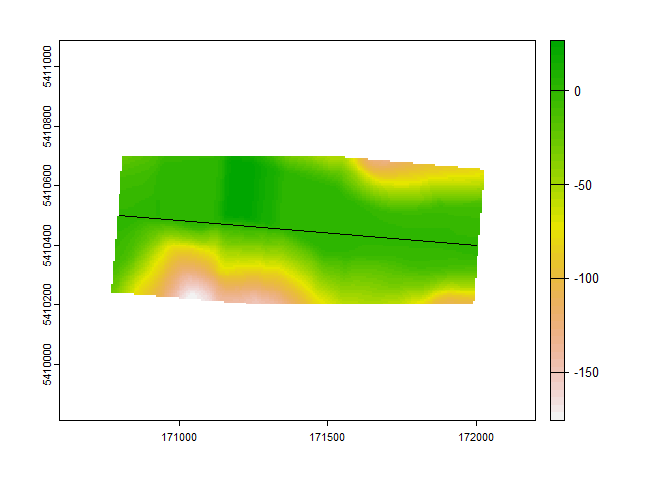
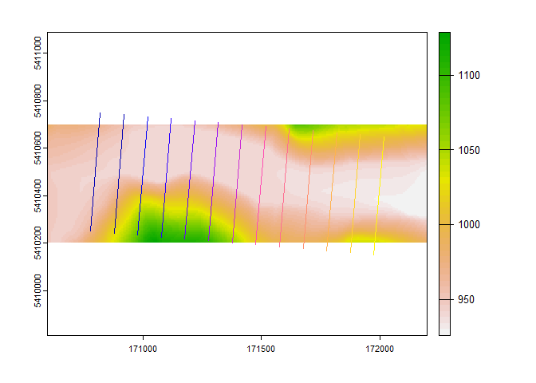

<!-- README.md is generated from README.Rmd. Please edit that file -->

# remr

<!-- badges: start -->

[](https://github.com/joshualerickson/remr/actions)
[](https://lifecycle.r-lib.org/articles/stages.html#experimental)
<!-- badges: end -->

The goal of `remr` is to get transects along a linestring so that you
can then perform a Relative Elevation Model. Thanks to
[paleolimbot](https://gist.github.com/paleolimbot/d24df1a288f355f89b69eb664dc54882?permalink_comment_id=4052200#gistcomment-4052200)
this process is now in a function!

## Contributions

Contributions are welcome! Please if you have any ideas or
recommendations submit an issue. Thanks.

## Installation

To install the development version of the `remr` package, you can
install directly from [GitHub](https://github.com/):

``` r
# install.packages("devtools")
devtools::install_github("joshualerickson/remr")
```

## Example

This is a basic example which shows you how to solve a common problem:
getting transects along a linestring and then extracting points on the
linestring and transects.

``` r
library(remr)
library(dplyr)

pts = matrix(c(170800,172000, 5410500, 5410400), 2)
line = sf::st_as_sf(sf::st_sfc(sf::st_linestring(pts), crs = 32612))

ele <- elevatr::get_elev_raster(line, z = 13, prj = '+proj=utm +zone=12 +datum=WGS84 +units=m +no_defs')

rem <- get_rem(line, ele, distance = 100, length = 500)

 ele_crop <- terra::crop(terra::rast(ele), terra::vect(sf::st_buffer(line, 200)))
 terra::plot(ele_crop)
 plot(line$x, add = TRUE)
 plot(rem$geometry, add = TRUE)
```


``` r
 
#get resolution to make more points
res <- terra::res(ele)
rem <- get_rem(line, ele, distance = res[[1]], length = 500)


#now convert to raster
rem_rast <- rem_raster(rem, ele_crop, fun = 'mean', window = 3, na.rm = TRUE)

terra::plot(rem_rast)
plot(line, add = TRUE)
```



``` r
 
transects <- get_transects(line, distance = 100, length = 500)

terra::plot(ele_crop)
plot(transects, add = TRUE)
```



``` r
 
points <- get_transect_points(line, distance = 100, length = 500)

terra::plot(ele_crop)
plot(points, add = TRUE)
```


``` r
#use nhdplus to get streams

pt <- sf::st_as_sf(sf::st_sfc(sf::st_point(c(-115.074062, 48.741195))), crs = 4326) %>% 
                         dplyr::rename(geometry = 'x')

streams <- gwavr::get_NLDI(pt)
#> [1] "site_data is of class sf and has 1 features"        
#> [2] "site_data is of class tbl_df and has 1 features"    
#> [3] "site_data is of class tbl and has 1 features"       
#> [4] "site_data is of class data.frame and has 1 features"
#> [1] "basin_boundary is of class sf and has 1 features"        
#> [2] "basin_boundary is of class tbl_df and has 1 features"    
#> [3] "basin_boundary is of class tbl and has 1 features"       
#> [4] "basin_boundary is of class data.frame and has 1 features"
#> [1] "UT is of class sf and has 28 features"        
#> [2] "UT is of class tbl_df and has 28 features"    
#> [3] "UT is of class tbl and has 28 features"       
#> [4] "UT is of class data.frame and has 28 features"
#> [1] "UM is of class sf and has 11 features"        
#> [2] "UM is of class tbl_df and has 11 features"    
#> [3] "UM is of class tbl and has 11 features"       
#> [4] "UM is of class data.frame and has 11 features"
ut <- streams$UT %>% sf::st_transform(32612)
ele <- elevatr::get_elev_raster(ut[1:5,], z = 13, prj = '+proj=utm +zone=12 +datum=WGS84 +units=m +no_defs')
```

``` r
# run in parallel

bm_rem <- microbenchmark::microbenchmark(
  'normal' = ut[1:5,] %>% 
  split(.$nhdplus_comid) %>%  
  purrr::map(~get_rem(., ele, terra::res(ele)[[1]], 500)),
  'parallel'  = {
    library(future)
    plan(multisession(workers = availableCores()-1))
    ut[1:5,] %>% 
  split(.$nhdplus_comid) %>%  
  furrr::future_map(~get_rem(., ele,  terra::res(ele)[[1]], 500))
  }, times = 5
)

ggplot2::autoplot(bm_rem) + 
  ggplot2::labs(title = '5 NHDPLUS COMIDs (5 times each)') +
  ggplot2::theme_bw()
```


<br>

**Below is a quick workflow to REMs**

``` r
# get elevations for each transect using rem

pinkam <- ut[1:5,] %>% 
  split(.$nhdplus_comid) %>%  
  furrr::future_map(~get_rem(., ele,  terra::res(ele)[[1]], 500))

# As of 2/9/2022 future_map crashes with one of the functions in rem_raster(), sorry...
pinkham_rast <- pinkam[c(ut[1:5,]$nhdplus_comid)] %>% 
                 purrr::map(~rem_raster(.,ele, na.rm = TRUE))

raa_tog <- terra::sprc(pinkham_rast)
t <- terra::mosaic(raa_tog)

t_crop <- terra::crop(t, sf::st_buffer(ut[1:5,], 200))
terra::plot(t_crop)
plot(ut[1:5,]$geometry, add = TRUE)
```


